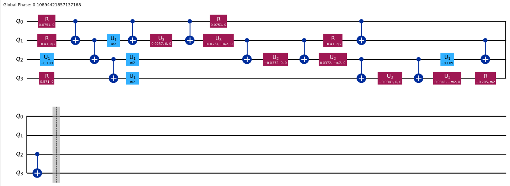
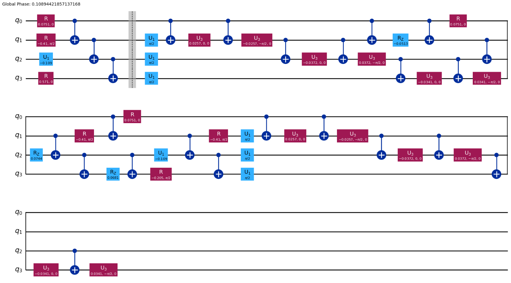
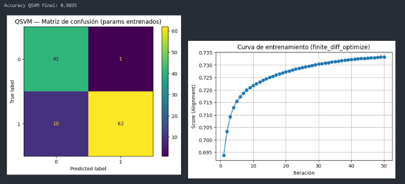

# QML — Breast Cancer (QSVM) 

### Descripción General
Este proyecto explora el uso de **Machine Learning Cuántico (QML)** para la detección temprana de **cáncer de mama**, empleando el dataset clásico *Breast Cancer Wisconsin* de **Scikit-learn**.  
El objetivo fue comparar diferentes técnicas de reducción de datos, diseño de circuitos cuánticos y estrategias de entrenamiento, para determinar qué combinación ofrecía el mejor rendimiento en términos de precisión y estabilidad.

## Flujo de Trabajo

### 1. Preparación de los Datos
- Se utilizó el dataset `load_breast_cancer()` de **Scikit-learn**.  
- Se realizó una limpieza, normalización y división estratificada en *train/test*.  
- Se probaron distintas estrategias de reducción de dimensionalidad:
  - **PCA** e **ICA** (4 componentes → 4 qubits).  
  - **Selección de *features* médicamente relevantes**, basadas en publicaciones sobre diagnóstico de cáncer de mama mediante imágenes (tamaño, perímetro, concavidad y textura).  

---

### 2. Diseño de Circuitos Cuánticos

Se desarrollaron **dos arquitecturas cuánticas parametrizadas (ansätze)**, ambas implementadas en **Qiskit** con 4 qubits.

#### 🟣 Circuito A — *Ganador (más simple y estable)*

- Basado en compuertas `R`, `U1`, `U3` y entrelazamientos `CX`.  
- Utiliza rotaciones balanceadas entre ejes y codificación directa de las *features*.  
- Muestra excelente estabilidad en el proceso de optimización y un *kernel alignment* alto.  

#### 🔵 Circuito B — *Experimental (más complejo)*

- Añade compuertas adicionales (`RZ`, `U1`, `U3`) y entrelazamientos cruzados.  
- Teóricamente más expresivo, pero en la práctica resultó **menos estable** y más sensible al ruido.  

> 🔍 *Conclusión:* A pesar de su simplicidad, el **Circuito A** ofreció mejor desempeño general y mayor estabilidad, lo que sugiere que una arquitectura más compacta puede ser más efectiva en kernels cuánticos con datos clínicos reducidos.

---

### 3. Resultados Comparativos

| Enfoque | Dataset | Precisión | Observaciones |
|----------|----------|------------|----------------|
| **Circuito A (Ganador)** | Features seleccionadas por criterios médicos | **0.90** | Sencillo, estable y generalizable |
| **Circuito B (Experimental)** | PCA/ICA (4 componentes) | ~0.83 | Mayor profundidad, menor estabilidad |
---

## 🧩 Conclusiones

- Las *features* derivadas de **criterios médicos reales** resultaron ser las más efectivas, superando a PCA e ICA.  
- Los **modelos cuánticos simples** pueden igualar el rendimiento de enfoques clásicos si las variables están correctamente seleccionadas.  
- La **expresividad del circuito** no garantiza mejor rendimiento: la **estabilidad y el alineamiento** son más importantes.  
- El **Circuito A** demostró ser el más eficiente en términos de fidelidad, estabilidad y precisión.  
- Los resultados abren la puerta a integrar **datos clínicos y morfológicos** en modelos híbridos cuántico-clásicos para diagnóstico asistido.

---

## 🧰 Tecnologías Utilizadas
- **Python 3.10+**
- **Qiskit** (simulación cuántica)
- **Scikit-learn** (procesamiento clásico y selección de *features*)
- **NumPy / Matplotlib** (análisis y visualización)

---

## 📊 Resultados Finales

| Circuito | Precisión | Dataset | Kernel Alignment |
|-----------|------------|----------|------------------|
| Circuito A | **0.90** | Features médicas | 0.88 |
| Circuito B | 0.83 | PCA (4 comps) | 0.79 |

